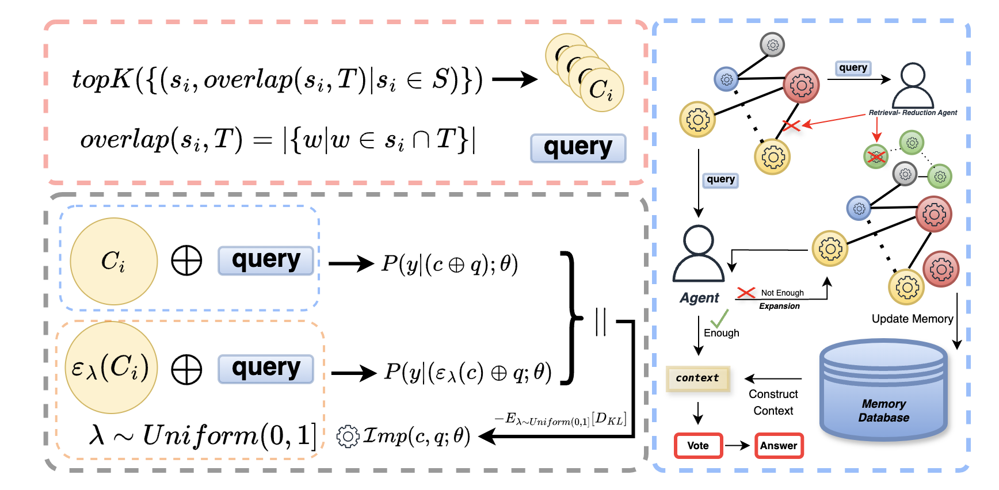

<p align="center">
  
</p>


# ELITE: Embedding-Less retrieval with Iterative Text Exploration

Large Language Models (LLMs) have achieved impressive progress in natural language processing, but their limited ability to retain long-term context constrains performance on document-level or multi-turn tasks. Retrieval-Augmented Generation (RAG) mitigates this by retrieving relevant information from an external corpus. However, existing RAG systems often rely on embedding-based retrieval trained on corpus-level semantic similarity, which can lead to retrieving content that is semantically similar in form but misaligned with the question's true intent. Furthermore, recent RAG variants construct graph- or hierarchy-based structures to improve retrieval accuracy, resulting in significant computation and storage overhead. In this paper, we propose an embedding-free retrieval framework. Our method leverages the logical inferencing ability of LLMs in retrieval using iterative search space refinement guided by our novel importance measure and extend our retrieval results with logically related information without explicit graph construction. Experiments on long-context QA benchmarks, including NovelQA and Marathon, show that our approach outperforms strong baselines while reducing storage and runtime by over an order of magnitude. 

## Table of Contents
- [Features](#features)
- [Project Structure](#project-structure)
- [Framework](#Framework)
- [Performance Analysis](#Performance-Analysis)
- [🔧 Installation & Quick Start](#-installation--quick-start)
- [📄 How to Get Results on NovelQA and Marathon](#-how-to-get-results-on-novelqa-and-marathon)


## Features

- **Embedding-Free Retrieval**: Eliminates the reliance on embedding models and dense retrievers.

- **Fast Response & Deployment**: Minimal offline preparation and indexing time enables fast responses and rapid deployment.

- **Lightweight Reasoning**: Utilizes LLMs’ native lexical and reasoning abilities—no need to construct graph or tree databases.

- **Strong Performance**: Outperforms baselines on long-context QA benchmarks such as NovelQA and Marathon.

## Project Structure

- `src/`: Core implementation of the embedding-free RAG framework.
- `reproduce/`: Scripts for reproducing experiments.
- `demo.py`: A runnable demo to test the pipeline.
- `requirements.txt`: List of dependencies.
- `.gitignore`: Standard ignored files.
- `Readme.md`: Project documentation.

## Framework

## Performance Analysis

### QA Retrieval Accuracy


### Average Query Time by Context Length and Query Volume


### Total Time Consumption by Context Length


## 🔧 Installation & Quick Start

### 1. Clone the repository

```bash
git clone https://github.com/tjzvbokbnft/Embedding-free-Retrieval.git
cd Embedding-free-Retrieval

#string_noise --> optional (To use this package, you must manually add it to your site-packages directory.
#If you don't need it, simply delete the related code. -->using without the importance metric)
pip install -r requirements.txt

#play with demo
#config your txt path in demo.py
#config other parameters in scr/local_config.py
python demo.py

# Reproduce on NovelQA benchmark
python reproduce/test_novelqa.py

# Reproduce on Marathon benchmark
python reproduce/test_marathon.py
```
### 2.Basic Usages


## 📄 How to Get Results on NovelQA and Marathon

### 📊 Benchmark & Evaluation

To evaluate the performance of this framework on **NovelQA** and **Marathon**, please follow the official benchmarking instructions:

#### 📘 NovelQA
- [GitHub Repository](https://github.com/NovelQA/novelqa.github.io)
- [Official leaderboard](https://novelqa.github.io/)
  

#### 🏃 Marathon
- [GitHub Repository](https://github.com/Hambaobao/Marathon)
- [Submission](https://openbenchmark.online/marathon/)

## License
- MIT 

## Citation
- If Embedding-free Retrieval assists in your research, please cite it as follows:

