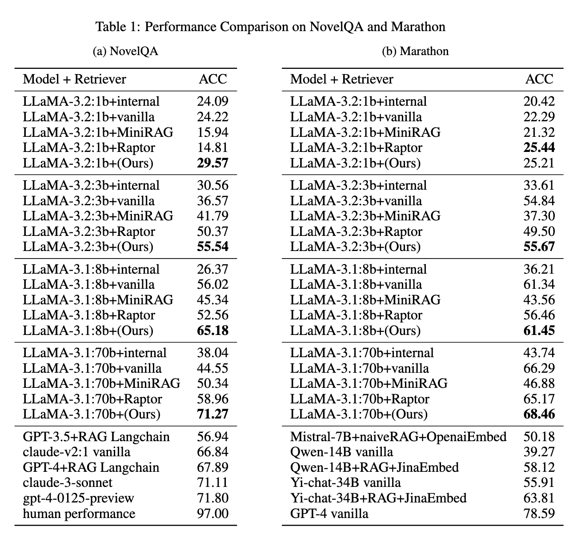

<p align="center">
  
</p>


# Embedding-free-Retrieval

This repository presents a lightweight, embedding-free retrieval-augmented generation (RAG) framework that replaces vector search with lexical overlap and iterative keyword refinement. It leverages LLM reasoning instead of static embeddings to enable fast and accurate long-context retrieval.

## Table of Contents
- [Features](#features)
- [Project Structure](#project-structure)
- [Performance Analysis](#Performance-Analysis)
- [🔧 Installation & Quick Start](#-installation--quick-start)
- [📄 How to Get Results on NovelQA and Marathon](#-how-to-get-results-on-novelqa-and-marathon)


## Features

- **Embedding-Free**: No need for dense vector indices or offline embedding generation.
- **Efficient**: Minimal preprocessing and indexing cost.
- **LLM-Aware**: Uses language model reasoning to guide retrieval.
- **Evaluated on**: NovelQA and Marathon datasets.

## Project Structure

- `src/`: Core implementation of the embedding-free RAG framework.
- `reproduce/`: Scripts for reproducing experiments.
- `demo.py`: A runnable demo to test the pipeline.
- `requirements.txt`: List of dependencies.
- `.gitignore`: Standard ignored files.
- `Readme.md`: Project documentation.

## Performance Analysis

### QA Retrieval Accuracy


### Average Query Time by Context Length and Query Volume


### Total Time Consumption by Context Length


## 🔧 Installation & Quick Start

### 1. Clone the repository

```bash
git clone https://github.com/<your_username>/Embedding-free-Retrieval.git
cd Embedding-free-Retrieval

#play with demo
python demo.py

# Reproduce on NovelQA benchmark
python reproduce/test_novelqa.py

# Reproduce on Marathon benchmark
python reproduce/test_marathon.py
```
### 2.Basic Usages
- config your txt path in demo.py
- config other parameters in scr/local_config.py

## 📄 How to Get Results on NovelQA and Marathon

### 📊 Benchmark & Evaluation

To evaluate the performance of this framework on **NovelQA** and **Marathon**, please follow the official benchmarking instructions:

#### 📘 NovelQA
- [GitHub Repository](https://github.com/NovelQA/novelqa.github.io)
- [Official leaderboard](https://novelqa.github.io/)
  

#### 🏃 Marathon
- [GitHub Repository](https://github.com/Hambaobao/Marathon)
- [Submission](https://openbenchmark.online/marathon/)

##License
- MIT 

##Citation
- If Embedding-free Retrieval assists in your research, please cite it as follows:

